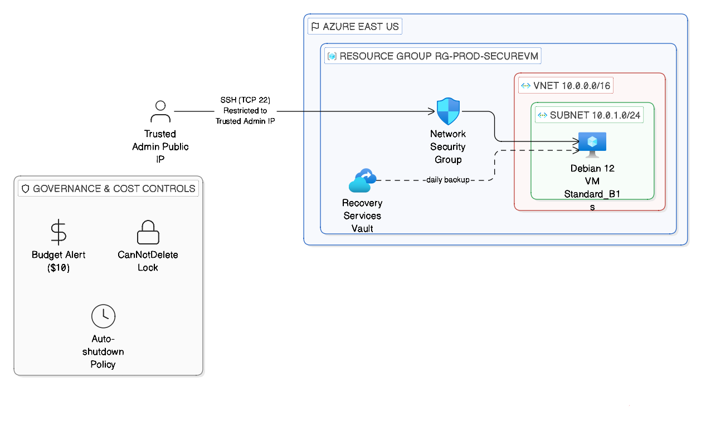

# 🚀 Azure Secure Production VM Deployment (Debian 12)

---

## 📌 Project Overview

This project demonstrates the design and deployment of a production-style Azure virtual machine environment using Debian 12, built under strict cost constraints (< $10/month) while maintaining enterprise-grade security, governance, and backup controls.

The objective was to simulate a real-world SMB production workload while applying AZ-104 administration principles.

---

## 🏗 Architecture Summary

- Resource Group: `rg-prod-securevm`
- Virtual Network: `10.0.0.0/16`
- Subnet: `10.0.1.0/24`
- VM: Debian 12 (Standard_B1s)
- NSG: SSH restricted to single public IP
- Recovery Services Vault: Daily backup enabled
- Auto-shutdown policy configured
- Budget alert: $10 monthly limit
- Resource lock applied (CanNotDelete)

---

## 🔐 Security Implementation

✔ SSH (Port 22) restricted to home public IP  
✔ No open inbound internet exposure  
✔ Subnet-level NSG enforcement  
✔ Delete lock to prevent accidental resource removal  
✔ Tagged resources for governance classification  

---

## 💾 Backup & Resilience

- Recovery Services Vault deployed
- VM protected with daily backup policy
- Restore points automatically generated
- Protection against accidental data loss

---

## 💰 Cost Optimization Strategy

To maintain operational costs under $10:

- Selected Standard_B1s burstable VM SKU
- Enabled daily auto-shutdown
- Avoided high-cost services (Bastion, Private Endpoint)
- Configured resource group budget alert
- Minimal monitoring footprint

---

## 🖥 Application Layer

Inside the VM:

- Installed NGINX
- Simulated internal production workload
- Verified service availability via SSH access

---

## 📂 Repository Structure

architecture/
documentation/
scripts/
screenshots/

---

## 🧠 Key Learning Outcomes

- Azure VNet design & subnet segmentation
- NSG rule hardening & IP restriction
- Backup configuration using Recovery Services Vault
- Cost-aware architecture design
- Governance enforcement via tagging & locks
- Azure CLI deployment automation

---

## 🔮 Future Improvements

- Implement Azure Bastion for zero-public-IP access
- Enable Log Analytics workspace for advanced monitoring
- Convert deployment into Bicep (Infrastructure as Code)
- Add Azure Policy enforcement
